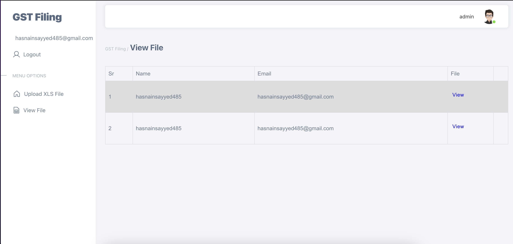
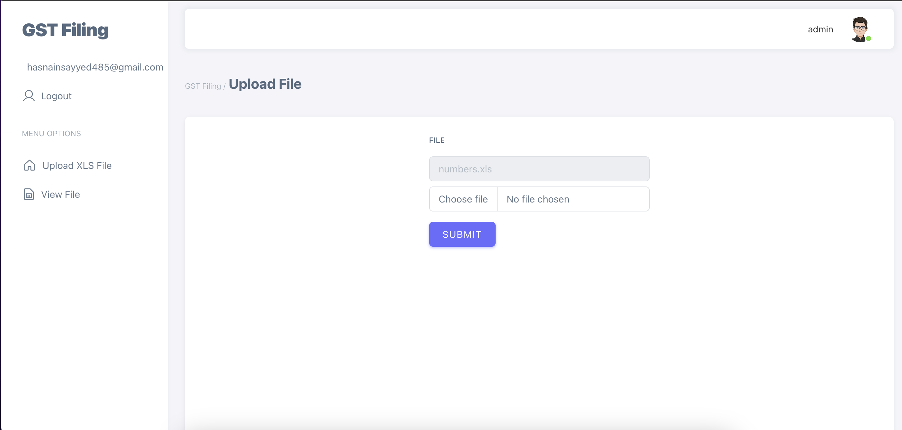
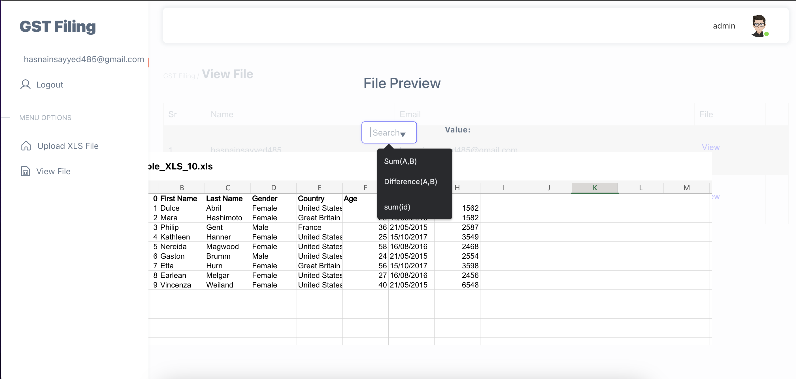
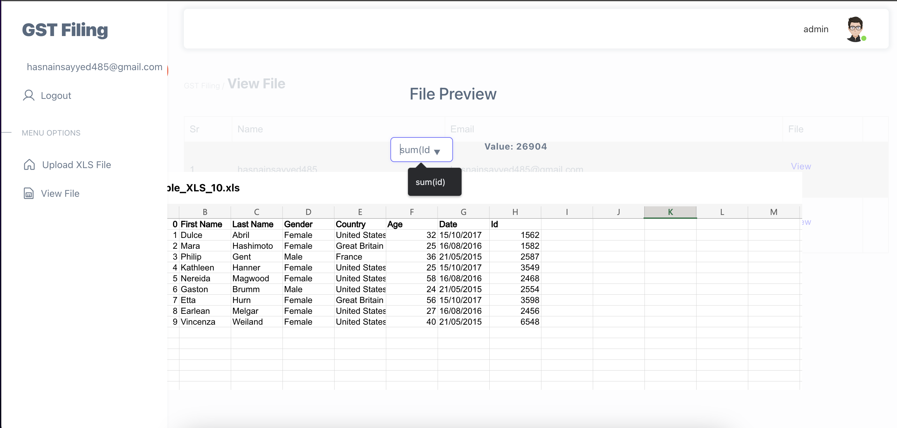
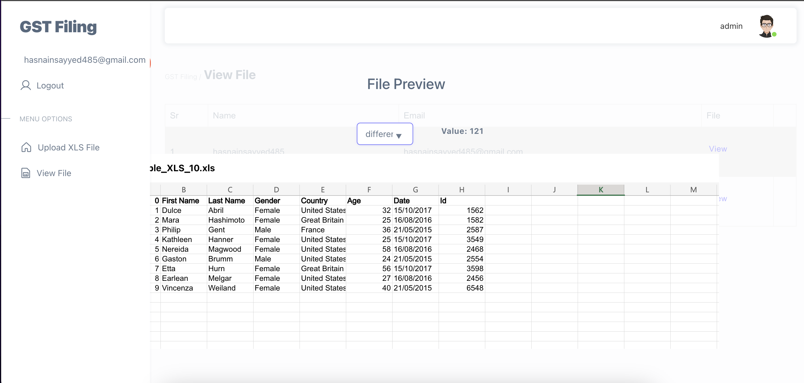

# Project Title - GST FILING APP

# Features:

1. User Registration: User registration endpoint (e.g., POST /api/register) where users can create an account.

2. User Login: Generate a JWT token upon successful authentication and return it in the response. The token should be used to authenticate all API requests.

3. Access Control and Authorization: A middleware that verifies the JWT token for protected routes. A role-based or permission-based access control system.

4. Token Validation and Refresh: A mechanism to validate and refresh the JWT token.
   Verify the integrity and expiration of the token on subsequent requests

5. Field Operations: A functionality in the admin panel to select specific columns and rows from the uploaded Excel file using dropdown selectors. It provides field to add formulas like SUM, Difference, etc., that can be applied to the selected column and row.
6. Data Storage and Management: Utilize Firebase's Storage to store the Excel file data.

7. Excel Data Visualization: A functionality to visualize the Excel file data in the Web.

# Tech Stack

- React JS
- Firebase Firestore
- Firebase Storage
- Firebase Authentication
- Node JS
- JWT Authentication
- Redux

## Screenshots

|  |  |  |  |
| :-------------------: | :----------------------: | :------------------------: | :-----------------------: |
|     Login Screen      |        View File         |        Upload File         |       Add formulas        |

|  |  |
| :-----------------: | :------------------------: |
|         Sum         |         Difference         |
